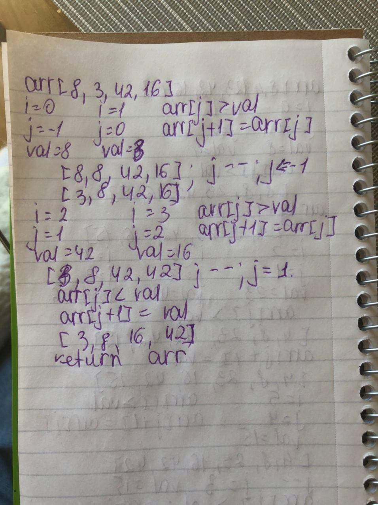

## Challenge Description
Implement insertion sort.

Insertion sort is a simple sorting algorithm that works similar to the way you sort playing cards in your hands. The array is virtually split into a sorted and an unsorted part. Values from the unsorted part are picked and placed at the correct position in the sorted part.

## Algorithm
To sort an array of size n in ascending order:
1: Iterate from arr[1] to arr[n] over the array.
2: Compare the current element (key) to its predecessor.
3: If the key element is smaller than its predecessor, compare it to the elements before. Move the greater elements one position up to make space for the swapped element.

## Approach & Efficiency
Time: O(n^2)
The basic operation of this algorithm is comparison. This will happen n * (n-1) number of times…concluding the algorithm to be n squared.
Space: O(1)
No additional space is being created. This array is being sorted in place…keeping the space at constant O(1).

## Input ---> Output

input : [2,10,1,3,45,4]
output: [1,2,3,4,10,45]
## Solution

