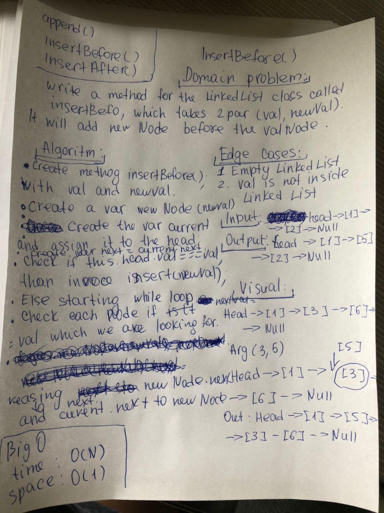

# Singly Linked List
Linked List - A data structure that contains nodes that links/points to the next node in the list.
Singly - Singly refers to the number of references the node has. A Singly linked list means that there is only one reference, and the reference points to the Next node in a linked list.

# v 1.0.0

## Challenge
Create a Node class that has properties for the value stored in the Node, and a pointer to the next Node.
Within your LinkedList class, include a head property. Upon instantiation, an empty Linked List should be created.
Define a method called insert which takes any value as an argument and adds a new node with that value to the head of the list with an O(1) Time performance.
Define a method called includes which takes any value as an argument and returns a boolean result depending on whether that value exists as a Node’s value somewhere within the list.
Define a method called toString (or __str__ in Python) which takes in no arguments and returns a string representing all the values in the Linked List, formatted as:
"{ a } -> { b } -> { c } -> NULL"

## Approach & Efficiency
Bog O
time: O (N)

## API
node.insert() - method insert takes any value as an argument and adds a new node with that value to the head of the list with an O(1) Time performance.

node.includes() - method includes takes any value as an argument and returns a boolean result depending on whether that value exists as a Node’s value somewhere within the list.

node.toString() - method toString takes in no arguments and returns a string representing all the values in the Linked List, formatted as:
"{ a } -> { b } -> { c } -> NULL"

# v 1.2.0

## Challenge

Write the following methods for the Linked List class:

.append(value) which adds a new node with the given value to the end of the list
.insertBefore(value, newVal) which add a new node with the given newValue immediately before the first value node
.insertAfter(value, newVal) which add a new node with the given newValue immediately after the first value node

## Approach & Efficiency
Bog O
time: O (N)

## Solution

